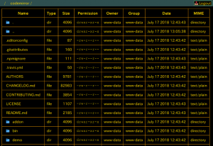
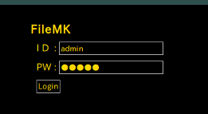
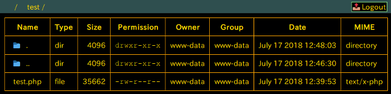
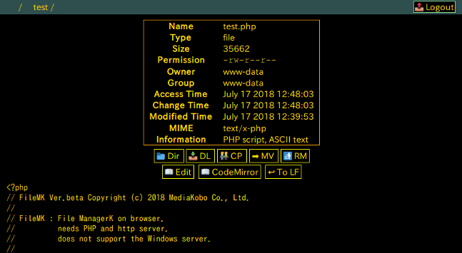
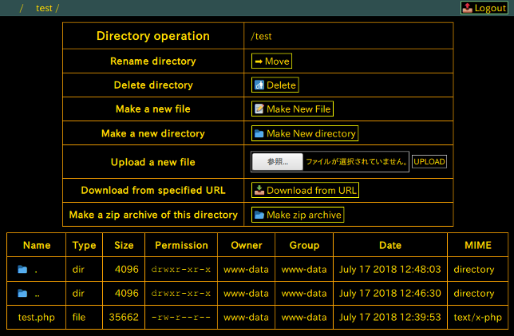
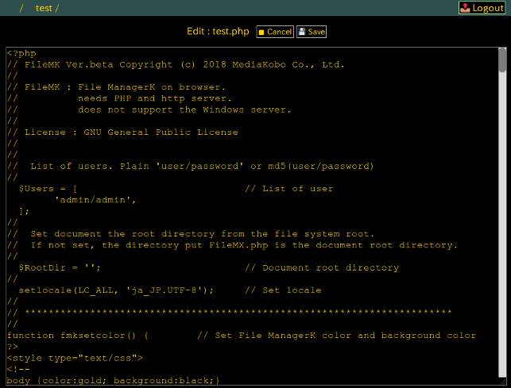
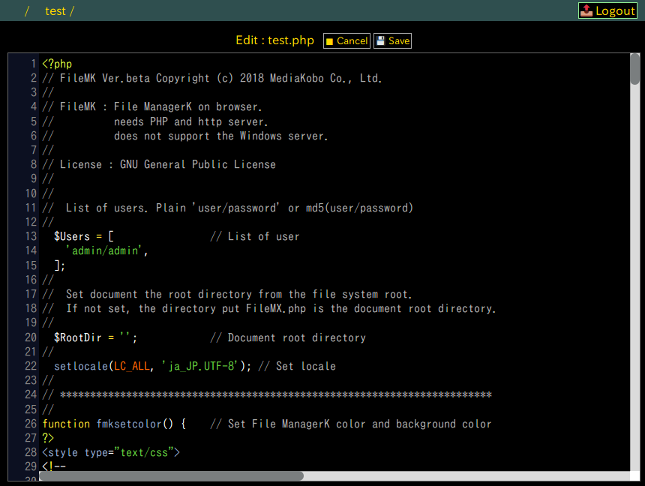
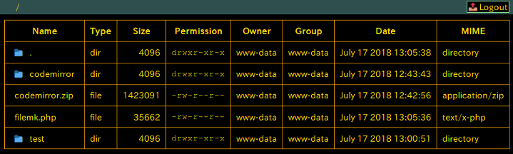
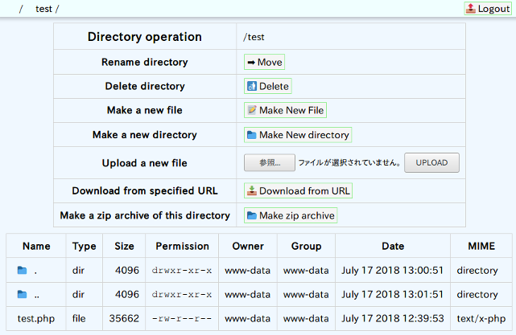

# FileMK


## 概要

File ManagerK は、ブラウザで、サーバのファイル管理を行うソフトウェアです。  

以下のイメージの様にディレクトリ下のファイルリストを表示したり、ファイルのアップロード、テキストファイルの編集などがブラウザ上で行えます。  

  

このソフトウェアは、 PHP で書かれているため、 PHP が動作する http サーバが必要です。  


## インストール

インストールは、ZIP アーカイブされたファイルをダウンロードし、 解凍して、http サーバにアップロードして下さい。プログラムは、”filemk.php” １本です。  
この際に、”filemk.php” というファイル名をわかりにくいファイル名に変更するとハッキングされにくくなります。  

ブラウザから、アップしたファイルにアクセスするとログイン画面が表示されます。  
ログインID： admin 、ログインPW： admin で “Login” すると利用できます。  


## 設定

設定変更は、直接 “filemk.php” ファイルの内容を書き換えて行います。  


### ユーザ ID とパスワード

ユーザIDとパスワードは、プログラムの最初にある $Users 配列の内容を書き換えて設定して下さい。  
平文で、ユーザID とパスワードを ‘/’ でつなげた文字列を書いても良いですし、’ユーザID/パスワード’ を MD5 でチェックサムを生成して、それを記述しても良いです。  
‘ユーザID/パスワード’は、複数個記述でき、いずれかにマッチすれば、ログインできます。  

    $Users = [
        'admin/admin',
        'a8abc0eb28fe60c7a568bea0e5cf1ac2'
    ];


### ドキュメントルートディレクトリ

ここで言うルートディレクトリ ($RootDir) は、このプログラムが管理するファイル・ディレクトリのトップディレクトリを指定します。  
プログラムの最初の方で設定します。ディレクトリの設定は、サーバのファイルシステムのルートディレクトリから指定して下さい。（例、’/var/www/html/document’)  
設定しない（空文字列の）場合、このプログラムが置かれたディレクトリをルートディレクトリとします。  
また、ルートディレクトリは、必ずしも http サーバが管理するドキュメントディレクトリ下になくても良いです。  

    $RootDir = '';


### ロケールの設定

適切にロケールが設定されてない場合、例えば、日本語のファイル名などが正常に操作できないようなときは、ロケールを設定して下さい。プログラムの最初の方で設定します。  
日本語で、文字コードとして UTF-8 を利用する場合、以下のようにコメント(‘//’)を外して設定して下さい。  

    setlocale(LC_ALL, 'ja_JP.UTF-8');


## 操作方法


### ログイン、ログアウト

ログイン画面が表示されたら、ユーザ ID とパスワード PW を入力して、　「Login」　ボタンを押して下さい。  

  

ログアウトは、画面の上部バーの右上に表示される　「&#x1f4e4; Logout」　ボタンを押して下さい。  


### ファイルリスト表示

ログインするとルートディレクトリのファイルリストが表示されます。  
ファイルリスト表示画面では、ディレクトリの移動やディレクトリ操作画面、ファイル操作画面への移動が行えます。  
画面の上部バーの左側には、ルートから今いるディレクトリが表示されます。ルート (‘/’) や表示されているディレクトリ名をクリックすると、そのディレクトリに移動します。  


  


ファイルリストの Name に表示されている親ディレクトリ　「&#x1f4c1;   ..  」　をクリックすると親ディレクトリに移動し、子ディレクトリ名　「📁   ディレクトリ名  」　をクリックすると子ディレクトリに移動します。  
「ファイル名」　をクリックすると、そのファイルの操作画面へ移動します。  
カレントディレクトリ名　「&#x1f4c1;  .  」　をクリックすると、カレントディレクトリの操作画面へ移動します。  


|         ボタン            | 操作内容 |
|---------------------------|----------|
|&#x1f4c1; .                | ディレクトリ操作パネルの表示|
|&#x1f4c1; ..               | 親ディレクトリへ移動|
|&#x1f4c1; *ディレクトリ名* | 子ディレクトリへ移動|
| *ファイル名*              | ファイルの操作画面へ移動|


### ファイル操作

ファイル操作画面では、より詳細なファイルの情報が表示され、ファイル名変更などの操作が行えます。  
テキストファイルや画像ファイルはその内容が表示されます。  


  


以下、操作ボタンの説明をします。  


|      ボタン        | 操作内容 |
|--------------------|----------|
|&#x1f4c1; Dir       | カレントディレクトリのファイルリスト表示へ移動|
|&#x1f4e5; DL        | ファイルをローカルへダウンロード|
|&#x1f46c; CP        | ファイルのコピー|
|&#x27a1;  MV        | ファイル名の変更|
|&#x1f6ae; RM        | ファイルの削除
|&#x1f4d6; Edit      | テキストファイルの編集画面へ移動|
|&#x1f4d6; CodeMirror| テキストファイルの CodeMirror による編集画面へ移動|
|&#x21a9; To LF      | テキストファイルの全ての改行コードを LF に変更|
|&#x1f4c2; Unzip     | ZIP アーカイブされたファイルの解凍|


### ディレクトリ操作

「&#x1f4c1;  .  」　をクリックすると、カレントディレクトリの操作画面へ移動します。  

ディレクトリ操作画面では、ディレクトリ名変更などの操作や新しいファイルのアップロード操作などが行えます。  
また、ディレクトリのファイルリストも表示され、その操作も行えます。  


  


|      ボタン                | 操作内容 |
|----------------------------|----------|
|&#x27a1; Move               | ディレクトリ名の変更|
|&#x1f6ae; Delete            | ディレクトリが空の場合、ディレクトリの削除|
|&#x1f4dd; Make New File     | 新しいファイルの作成|
|&#x1f4c1; Make New directory| 新しいディレクトリの作成|
|参照 ... UPLOAD             | ローカルからサーバへファイルのアップロード<br>「参照」でローカルのファイルを指定し、<br>「UPLOAD」でサーバへアップロードする|
|&#x1f4e5; Download from URL | 指定した URL のファイルをサーバへダウンロード|
|&#x1f4c2; Make zip archive  | 現在のディレクトリ下のファイル・ディレクトリを全て<br>”ディレクトリ名.zip”ファイルにアーカイブ|


### テキストファイル編集

テキストファイルの場合、ファイル操作画面から「&#x1f4d6; Edit」ボタンを押すとファイルの編集画面に移動し、編集が行えます。  


  


また、CodeMirror がインストールされている環境では、ファイル操作画面から「&#x1f4d6;CodeMirror」ボタンを押すとCodeMirror によるファイルの編集画面に移動し、編集が行えます。  


  


以下、テキストファイル変数画面での操作ボタンの説明をします。  


|    ボタン     | 操作内容 |
|---------------|----------|
|&#x25fc; Cancel| 編集内容を破棄しファイル操作画面へ移動|
|&#x1f4be; Save | 編集内容を保存|


## CodeMirror

CodeMirror を利用すると、テキスト表示に、行番号を付与したり、プログラム言語に合わせて色付けしたりできます。  
詳細は、 CodeMirror のサイト https://codemirror.net/ を参照して下さい。  

ここでは、本プログラムを利用して、 CodeMirror のインストールを行ってみます。  

本プログラムのディレクトリ操作画面で、「&#x1f4e5; Download from URL」ボタンを押し、 URL としてCodeMirror のプログラム  

http://codemirror.net/codemirror.zip  

を指定して、 CodeMirror のサイトから、プログラムを直接サーバへダウンロードします。  
ダウンロードされたプログラムをクリックし、ファイル操作画面から「&#x1f4c2; Unzip」ボタンを押し、 ZIP アーカイブを解凍します。  
解凍したディレクトリはバージョン番号がついていたので、ディレクトリ操作画面で、「➡ Move」ボタンを押し、バージョン番号がないディレクトリ名に変更します。  
本プログラムと codemirror のディレクトリが同じディレクトリにあれば、 設定の変更なしにCodeMirror を利用した編集ができるはずです。  


  


本プログラムでは、 CodeMirro の設定は、本プログラムの最下部にあるので、必要に応じて変更して下さい。  


CodeMirror の設定例  

```
      <link rel="stylesheet" href="codemirror/lib/codemirror.css">
      <link rel="stylesheet" href="codemirror/theme/blackboard.css">
      <script src="codemirror/lib/codemirror.js"></script>
      <script src="codemirror/mode/css/css.js"></script>
      <script src="codemirror/mode/xml/xml.js"></script>
      <script src="codemirror/mode/javascript/javascript.js"></script>
      <script src="codemirror/mode/htmlmixed/htmlmixed.js"></script>
      <script src="codemirror/mode/clike/clike.js"></script>
      <script src="codemirror/mode/php/php.js"></script>
      <script>
        var editor = CodeMirror.fromTextArea(document.getElementById("fmk-edittext"), {
          mode: "application/x-httpd-php",
          theme: "blackboard",
          tabSize: 4,
          lineNumbers: true
        });
        editor.setSize("100%", "100%");
      </script>
```


## カラー変更

ブラウザで表示する色の好みは、個人差があると思うので、表示する色を変更したい場合は、本プログラムの最初の方にある、 fmksetcolor 関数の内容を参考にして適宜変更して下さい。  
この関数で設定してあるスタイルを全て削除すると、以下のような明るい色をベースとした表示になります。  


  


この表示色で CodeMirror を利用している方は、 CodeMirror の設定で、「theme: “blackboard”,」も削除して下さい。  


## 注意点

本プログラムで、正常に動作しないなどの問題点がある場合には、以下の点も参考にして下さい。  


### アクセス権限

本プログラムでサーバのファイルに変更を加える場合には、 http サーバの実行者でアクセス可能な権限が必要です。  


### ファイルサイズ制限

本プログラムでファイルのアップロードなどができない場合には、PHP で扱うファイルサイズの制限にかかっている場合があります。  
php.ini の以下の内容などを適宜変更して下さい。  

 + file_uploads
 + memory_limit
 + post_max_size
 + upload_max_filesize
