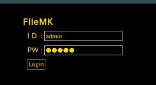
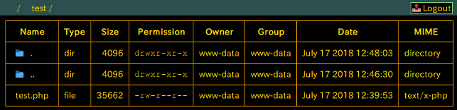
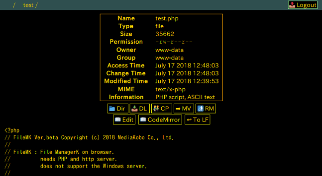

# File MK

FileMK is a server-side file manager implemented in PHP for the browser.  
It shows directories and files of your server like below, uploads a file, edits a text file etc...  

  

## Install

To install, only put the 'filemk.php' file on your http-php server.  
Access the file by  
 + Login-ID : admin  
 + Login-PW : admin  
it shows the list of server's files.   
For security, change the 'filemk.php' name as you want.  

## Preference

To change the preference, edit 'filemk.php' file directly.  

### Users and Passwords

To change the user and password, edit the '$Users' array at the head of 'filemk.php'.  
You can set the user and password in the plain text connected by '/' or set the md5 sum of 'user/password'.  

    $Users = [
        'admin/admin',
        'a8abc0eb28fe60c7a568bea0e5cf1ac2'
    ];

You can write the list of user/password pair.  

### Document root directory

The '$RootDir' is the top directory handled by 'filemk.php'.  
Set the document root '$RootDir' from your server's root directory at the head of 'filemk.php'.  
If '$RootDir' is '', '$RootDir' is the same of the 'filemk.php' existence directory.  

    $RootDir = '';

### Locale

If you find the localized problem, try to set the locale as you suit.  

For example,

    setlocale(LC_ALL, 'ja_JP.UTF-8');

## Operation

### Login

When the following screen is displayed, input your user id and password and press the 'Login' button.  

  

### Logout

To logout, press '&#x1f4e4; Logout' button at the top right of the screen.  
When you do not access the server for a while, logout automatically.  

### File list

Successful login shows the file list of the document root directory.  

  

|         Button            | Operation |
|---------------------------|-----------|
|&#x1f4c1; .                | Show the directory operation panel|
|&#x1f4c1; ..               | Move to the parent directory|
|&#x1f4c1; *directory name* | Move to the child directory|
| *file name*               | Show the detail of file and the operation panel|

### Operate file

Clink the file name on the file list, shows the detail of th file and the file operation panel.  

  

|      Button        | Operation |
|--------------------|-----------|
|&#x1f4c1; Dir       | Move to the file list of the current directory|
|&#x1f4e5; DL        | Download the file|
|&#x1f46c; CP        | Copy the file|
|&#x27a1;  MV        | Rename and move the file|
|&#x1f6ae; RM        | Remove the file|
|&#x1f4d6; Edit      | Edit the text file|
|&#x1f4d6; CodeMirror| Edit the text file by CodeMirror|
|&#x21a9; To LF      | Change the new line code 'LF'|
|&#x1f4c2; Unzip     | Unzip the zip archived file|

### Operate directory

Click '&#x1f4c1;   .  ' button shows the directory operation panel.  

  

|      Button                | Operation |
|----------------------------|-----------|
|&#x27a1; Move               |Rename the directory name|
|&#x1f6ae; Delete            |Delete the empty directory|
|&#x1f4dd; Make New File     |Make a new file|
|&#x1f4c1; Make New directory|Make a new directory|
|Select ... UPLOAD           |Upload a local file|
|&#x1f4e5; Download from URL |Upload a specifiled url file|
|&#x1f4c2; Make zip archive  |Make a zip archive of the current directory|

### Edit the text file

Edit button pressed, you can edit the text file on textarea.  

  

Set up the CodeMirror(https://codemirror.net/) and revise the end part of 'fileml.php'.
CodeMirror button pressed, you can edit the text file on CodeMirror.  

  

|    Button     | Operation |
|---------------|-----------|
|&#x25fc; Cancel|Cancel the edit and move to the file operation panel|
|&#x1f4be; Save |Save the edit file|

